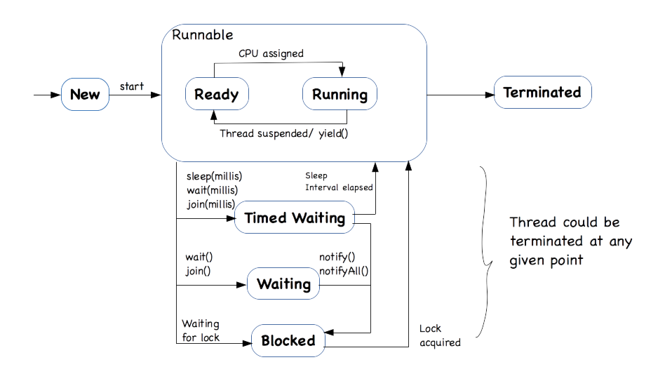

# Threading and Concurrency

## Introduction

In the previous modules we have seen how to write sequential programs, where each statement is executed one after another. However, in real world applications, there are multiple tasks that need to be performed simultaneously. For example, in a web server, it needs to handle multiple client requests at the same time. To achieve this, we need to use threading and concurrency concepts in programming.

## True Parallelism vs Logical Parallelism

True parallelism is achieved by assigning tasks to individual CPUs or Processors. This is possible through multicore processors or executing the tasks using multiple CPUs.

If there is one CPU and you want to perform multiple tasks in parallel, then CPU will be shared across those tasks for some stipulated time interval, which stands for interleaved execution, and this way of executing the tasks is known as logical parallelism or psuedo parallelism. 

In case of logical parallelism, lets assume there are two tasks T1 and T2, when executed in parallel and using one CPU, CPU is switched between T1 and T2 i.e. CPU executed T1 for some stipulated time interval and then switched to T2. Once T2's time slice is completed then it is switched back to T1 and starts from where it stops. 

## Threads

A thread is a lightweight process that can run concurrently with other threads within the same program. Each thread has its own call stack, program counter, and local variables, but shares the same memory space with other threads in the same process. Java provides built-in support for threading through the `java.lang.Thread` class and the `java.lang.Runnable` interface. You can create a thread by extending the `Thread` class or implementing the `Runnable` interface. 

## Approach1 : Extending the Thread class 

In the below example Task is a Thread(explained later), and run is the entry point of the thread execution where it starts printing 1500 T's. 

main() runs in Thread i.e. the Main thread which is started by the JVM. 

Note In the main method we are not calling doTask directly, instead we are using the start() method of the Thread class, which runs the Task using a separate Thread.

```java

class Task extends Thread {
	
    // Thread execution begins here.
    public void run() {
        // performs the task i.e. prints 1500 T's
        doTask();
    }
	
    public void doTask() {
        for(int i=1; i <= 1500; i++) {
            System.out.print("T");
        }
    }
}

public class Main {

    // Runs with in the Main thread started by JVM.
    public static void main(String[] args) {
		
        Task t1 = new Task();
        
        // Starts a separate Thread using the 
        // the start method of the Thread class.
        t1.start(); 

        // runs in the Main thread and prints 1500 M's
        for(int i=1; i <= 1500; i++) {
            System.out.print("M");
        }	
    }
}
```

Here main() and Task are run using two separate threads, which means they are executed in parallel (logical parallelism in case of single CPU) and hence you will see output like MMMTTTMMMTTT...

## Approach2 : Implementing the Runnable interface

Another way to create a thread is by implementing the `Runnable` interface. This approach is preferred when your class needs to extend another class, as Java does not support multiple inheritance. In this approach, you create a class that implements the `Runnable` interface and override the `run()` method. Then, you create a `Thread` object and pass an instance of your `Runnable` class to the `Thread` constructor.

```java

class Task implements Runnable {
    // Thread execution begins here.
    public void run() {
        // performs the task i.e. prints 1500 T's
        doTask();
    }
    
    public void doTask() {
        for(int i=1; i <= 1500; i++) {
            System.out.print("T");
        }
    }
}

public class Main {

    // Runs with in the Main thread started by JVM.
    public static void main(String[] args) {
        
        Task task = new Task();
        
        // Creating a Thread and passing the 
        // Runnable object to it.
        Thread t1 = new Thread(task);
        
        // Starts a separate Thread using the 
        // the start method of the Thread class.
        t1.start(); 

        // runs in the Main thread and prints 1500 M's
        for(int i=1; i <= 1500; i++) {
            System.out.print("M");
        }	
    }
}
```

Both approaches achieve the same result, but implementing the `Runnable` interface is generally preferred for better flexibility and to avoid the limitations of single inheritance in Java.

## Thread States

A thread can be in one of the following states:

illustrated in the diagram below:


* NEW: A thread that is created but not yet started is in this state.
* RUNNABLE: A thread executing in the Java virtual machine is in this state, internally we can think of it as a combination of two sub states Ready and Running, i.e. when you start the thread it comes to Ready state and wait for the CPU, and if CPU is allocated then it goes into Running state. Once allocated CPU time is completed, in other words when the Thread schedular suspends the thread then it goes back to the Ready state and waits for its turn again. 
* BLOCKED: A thread is blocked if it is waiting for a monitor lock is in this state. Refer synchronized methods and blocks.
* WAITING: A thread that is waiting indefinitely for another thread to perform a particular action is in this state. Refer wait(),  join()
* TIMED_WAITING: A thread that is waiting for another thread to perform an action for up to a specified waiting time is in this state. Refer wait(millis), join(millis)
* TERMINATED: A thread that has exited i.e. it has either completed its task or terminated in the middle of the execution. 


## Thread Synchronization

 Thread synchronization is used to solve concurrency problems that exist in parallel processing. Concurrency problem exist when more than one thread is accessing the same shared resource. 

E.g. 
 1) More than one transaction is being performed on the same account
 2) Multiple resources are booking tickets for the same train from different locations.
etc.

### Synchronization in Java Threads

It can be achieved through 
  1) Synchronized methods
  2) Synchronized block
  3) Locks (out of scope)

#### synchronized method

Consider the class Sample 

```java
class Sample {
    synchronized void f() {...}
}
```

Consider Three threads T1, T2, T3 and two objects for Sample they are A,B.

```
T1  ..........A.f();  locks A and proceeds
T2  ..........B.f();  locks B and proceeds
T3  ..........A.f();  wait till T1 unlocks A.
```

To run a synchronized method object must be locked. 

#### synchronized block

When synchronization is not required for the entire method i.e only certain part of the code must be synchronized then we use synchronized block.

```java      
synchronized( object ) {
  // operations over the object
}
```

The above code is executed only after obtaining lock over the object.

#### Thread Safe Code or Re-entrant code:-

When a code block is safe from concurrency problems then the code is referred as thread safe or re-entrant.In case of the below operation incr() operation is considered as thread safe or re-entrant.

Example - 

In the below example try removing synchronized keyword before the incr() operation and check the result. You will find inconsistent result. By making the method synchronized, we are forcing the thread to lock the object before performing the incr() operation. Though control is intentionally passed to other thread, other thread won't be able to proceed with the operation as it need to first lock (obj) before proceeding forward. 

i.e. lets assume t1 locks obj then t2 should wait till t1 releases the lock, hence object is modified by only one thread at a time and you will see consistent results.

```java

class Sample {
	
    private int x;

    public int getX() {
	    return x;
    }

    public void setX(int x) {
	    this.x = x;
    }
	
    /*
     * Try removing synchronized. 
     */
    public synchronized void incr() {
		
        // read the value of x.
        int y = getX();

        // Increment the value
        y++;
            
        // Just assume if control is switched to 
        // some other thread and it too looks at
        // the old value of x and proceeds with 
        // modification. Such scenarios lead to 
        // in consistent results.
        // To simulate such scenarios lets us just
        // pass the control to some other thread. 
        
            // with sleep this thread will go to blocked state
            // for the given time interval, hence other thread
            // will get a chance.
        try { Thread.sleep(1); } catch(Exception e) {}
            
        // set x to new value.
        setX(y);
    }
}

class MyThread extends Thread {
	
    Sample obj;
	
    public MyThread(Sample obj) {
        this.obj = obj;
    }
	
    public void run() {
	    obj.incr();
    }
	
}


public class Main {

    public static void main(String[] args) {

	Sample obj = new Sample();
	obj.setX(10);
		
	// In this case both the threads t1 and t2
	// are sharing the same Sample object obj.
	// Both the threads will try to perform the
	// increment operation simultaneously.

	MyThread t1 = new MyThread(obj);
	MyThread t2 = new MyThread(obj);
		
	t1.start();
	t2.start();
        
    // Here main thread called the join operation 
    // on t1 and t2. join() operations waits for 
    // thread to complete before returning.		
	try {
	    t1.join();
        t2.join();
	} catch (InterruptedException e) {
	    e.printStackTrace();
	}	
	
	System.out.println( obj.getX() );		
    }

}
```

#### Synchronizing static data operations - 

Is the below increment() operation thread-safe ?

```java

class Sample {

    static int a = 5;
    int b = 10;

    public synchronized void increment( ) {
        a++;
	    b++;
    }

    // ....
}
```

Answer is NO. Because we made it synchronized we may think that it is thread-safe but it is not. And it is because of the static variable a. Lets assume that there are two objects for Sample, in that case both of them will share the same copy of a because it is a class member, where as they get different copies of b, because b is non static i.e. the instance member and each instance will get a separate copy of b.

Assume Thread 1 invoked the increment method over the first object and Thread 2 invoked the increment method over the second object. Because the increment() method is non-static and it is synchronized, object should be locked before getting into the method. 

Here Thread1 locks the first object and gets in and also Thread 2 locks the second object and gets in, because both are different objects and hence both the thread acquire locks and they both proceed with the operation. 

You can see that b++ is not having any issues, because both the threads are operating on different copies of b, but what about a++ it is still not thread safe.

Solution 1 - 

```java
class Sample {

    static int a = 5;
    int b = 10;

    public  void increment( ) {
        // lock the Class object before modifying
        // static content.
        synchronized(Sample.class) {
            a++;
        }
        
        // lock the object before modifying 
        // instance members.    
        synchronized(this) {
	        b++;
        }
    }
    
    // ....
}
```

In this case the increment() operation is thread-safe, because for modifying the static member 'a' we are locking the class object, Sample.class returns a reference to class object and synchronized block will acquire lock over the object and then proceed forward with the operation. And for b++ we are locking the current object using the this reference. And hence both the operations are now thread-safe, as we properly locked the corresponding object before modification.

Solution 2 - 

```java
class Sample {

    static int a = 5;
    int b = 10;

    // This method is static and hence it locks the Class object.
    public static synchronized void incrementA( ) {
	    a++;
    }

    // This method is non static and hence it locks the object
    // on which it is invoked.
    public synchronized void increment( ) {
        incrementA();
		b++;
    }

    // ....

}
```

Create a static method for incrementing a and declare it as synchronized, so that when the thread enters this method it locks the class object. Just remember that whenever you are modifying the static content in a multi-threaded environment you should lock the class object to make your code thread-safe.

#### Issue with synchronized methods - (Out of scope, but important to understand)

Synchronized methods doesn't always solve concurrency problems. Lets consider a simple List class and assume that the size() and add() operations are synchronized 

```java
class List {
    ...
    public synchronized int size(){
	...
    }

    public synchronized void add(Object value) {
	....
    }
}
```

You can think that there is no concurrency issue here. But, lets analyze a simple scenario consider that list should not contain more than 5 elements, and assume that list is already having 4 elements and two threads are trying to insert an element into the list.

```
Thread 1 - 

1) if (list.size() < 5) {
2) 	 list.add(value1);
   }

Thread 2 -

a) if (list.size() < 5) {
b) 	 list.add(value2);
   }
```

Lets assume this execution sequence (1)(a)(2)(b) in this case both threads will see that list size is 4 and is less than 5. Hence both will add an element into the list, which makes the list size as 6 violating the condition. You can see the issue is not resolved even with both size() and add() being synchronized methods.

Solution - 

You should apply thread synchronization at operation level with the help of synchronized block. i.e.

```
Thread 1 - 	

1) synhronized(list) {
2)   if (list.size() < 5) {
3) 	     list.add(value1);
     }
   }

Thread 2 -

a) synchronized(list) {
b)   if (list.size() < 5) {
c) 	    list.add(value2);
     }
   }
```

Now consider the execution sequence ```(1)(a)(2)(3)(b)(c)```

You can see that list object is locked by Thread1 and hence even when the control switched to Thread2 it can not proceed as the lock is with Thread1. And Thread1 will add the element where as Thread2 will fail.

So when it comes to synchronizing operations synchronized blocks are always better choice over synchronized methods.